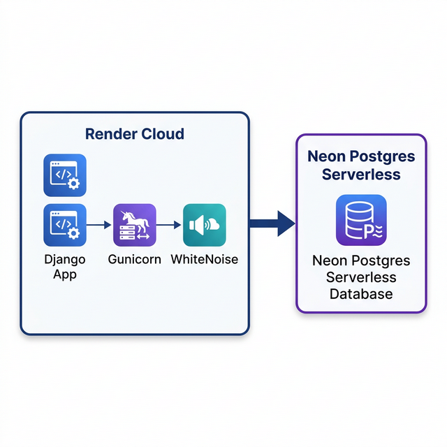

# 🌬️ Essences Ar-Condicionados — Sistema Web de Gestão e Captação

> **Projeto Integrador III — UNIVESP**  
> Cliente real: **Maurício Jachetto** (Essences Ar-Condicionados)

---

## 📋 Sobre o Projeto

Este repositório contém o **sistema web completo** desenvolvido como Projeto Integrador para a UNIVESP. A aplicação atende a um prestador de serviços autônomo de ar-condicionado e resolve dois problemas reais identificados:

1. **Falta de organização operacional**: nenhum sistema formal para gerenciar clientes, serviços e estoque de materiais.
2. **Falta de presença digital**: nenhum canal online para captação de novos clientes.

**A solução entregue:**
- 🔐 **Backoffice privado** (AdminLTE v4 + Django) com CRUD completo de Clientes, Serviços e Materiais.
- 📊 **Dashboard analítico** com gráficos dinâmicos (Chart.js) mostrando o status dos serviços.
- 🌐 **Landing Page pública**  para captação de leads em **https://piunivesp3.onrender.com/**.
- ☁️ **Hospedagem em Nuvem**: Aplicação no **Render** e Banco de Dados no **Neon Postgres**.
- 🧪 **Testes unitários** e **CI/CD** com GitHub Actions.

---

## 🏗️ Arquitetura e Nuvem

O projeto utiliza uma infraestrutura moderna, escalável e baseada em containers:



- **Aplicação:** [Render](https://render.com) (PaaS via Docker)
- **Link de Produção:** [https://piunivesp3.onrender.com/](https://piunivesp3.onrender.com/)
- **Banco de Dados:** [Neon Postgres](https://neon.tech) (Postgres Serverless)
- **Serving de Estáticos:** WhiteNoise (Integrado ao Django para máxima performance no Render)

---

## 🚀 Como Executar Localmente

### Pré-requisitos
- [Docker](https://docs.docker.com/get-docker/) e Docker Compose instalados

```bash
# 1. Clone o repositório
git clone https://github.com/ropecual/PIUNivesp3.git
cd PIUNivesp3

# 2. Inicie o ambiente (reconstrói a imagem com as novas dependências)
docker-compose up --build

# 3. Acesse em: http://localhost:8585
```

---

## ⚙️ Variáveis de Ambiente (`.env`)

Para rodar em nuvem (Render) ou localmente, configure:
- `DATABASE_URL`: URL de conexão do Neon Postgres.
- `SECRET_KEY`: Chave do Django.
- `ALLOWED_HOSTS`: `piunivesp3.onrender.com,localhost`

---

## 🛠️ Stack Tecnológica

| Camada           | Tecnologia                 |
|------------------|----------------------------|
| Backend          | Python 3.12 + Django 6     |
| Frontend         | AdminLTE v4 + Bootstrap 5  |
| Hospedagem App   | **Render**                 |
| Banco de Dados   | **Neon Postgres**          |
| Serving Estático | WhiteNoise                 |
| Servidor (WSGI)  | Gunicorn                   |

---

## 👥 Equipe

Projeto desenvolvido por alunos do curso da **UNIVESP** como requisito parcial da disciplina de Projeto Integrador III.
